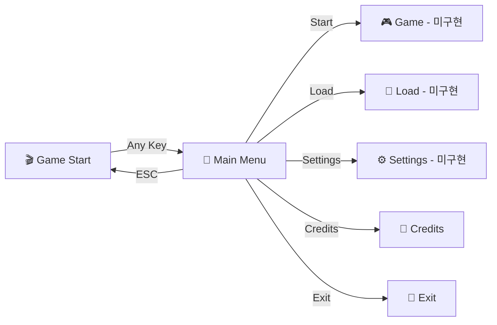

# 🎮 INDI INHA - Adventure Game

> 웹 기반 인터랙티브 어드벤처 게임

**INDI INHA**는 현대적인 웹 기술로 구현된 클래식 스타일의 어드벤처 게임입니다. 브라우저에서 바로 실행할 수 있으며, 키보드와 마우스 모두를 지원하는 직관적인 인터페이스를 제공합니다.

## ✨ 주요 특징

- 🌐 **순수 웹 기술**: HTML5, CSS3, Vanilla JavaScript로 구현
- ⌨️ **다중 입력 지원**: 키보드, 마우스, 터치 입력 모두 지원
- 📱 **반응형 디자인**: 데스크톱부터 모바일까지 모든 기기 지원
- 🎨 **모던 UI/UX**: 레트로 게임의 감성을 현대적으로 재해석
- ⚡ **빠른 로딩**: 외부 의존성 없는 가벼운 구조

## 🚀 빠른 시작

### 실행 방법
1. 프로젝트를 클론하거나 다운로드합니다
2. `ui/game-start/index.html` 파일을 브라우저에서 엽니다
3. 아무 키나 눌러 게임을 시작합니다!

```bash
# Git으로 클론하기
git clone https://github.com/qqpmzz/INDI_INHA.git
cd INDI_INHA

# 게임 시작 (브라우저에서 열기)
# Windows
start ui/game-start/index.html

# macOS
open ui/game-start/index.html

# Linux
xdg-open ui/game-start/index.html
```

## 📁 프로젝트 구조

```
INDI_INHA/
├── README.md                 # 프로젝트 개요 및 사용법
├── docs/
│   └── UI_Documentation.md   # 상세 UI 문서
└── ui/                       # 사용자 인터페이스
    ├── game-start/          # 게임 시작 화면
    │   ├── index.html       # 메인 HTML
    │   ├── style.css        # 스타일시트
    │   └── script.js        # 인터랙션 로직
    └── main-menu/           # 메인 메뉴 화면
        ├── index.html       # 메뉴 HTML
        ├── style.css        # 메뉴 스타일
        └── script.js        # 메뉴 로직
```

## 🎯 게임 플로우



## 🎮 조작 방법

### 게임 시작 화면
- **아무 키 입력**: 메인 메뉴로 이동
- **마우스 클릭**: 메인 메뉴로 이동
- **터치**: 메인 메뉴로 이동 (모바일)

### 메인 메뉴
- **↑/↓ 방향키 또는 W/S**: 메뉴 선택
- **Enter 또는 Space**: 메뉴 실행
- **ESC**: 게임 시작 화면으로 돌아가기
- **마우스**: 호버 및 클릭으로 메뉴 조작

## 📋 구현 상태

| 화면/기능 | 상태 | 설명 |
|-----------|------|------|
| 🎬 게임 시작 화면 | ✅ 완료 | 타이틀 화면 및 키 입력 감지 |
| 📱 메인 메뉴 | ✅ 완료 | 5개 메뉴 옵션 및 네비게이션 |
| 🎮 게임 화면 | ⏳ 예정 | 실제 게임플레이 인터페이스 |
| 💾 세이브/로드 | ⏳ 예정 | 게임 저장 및 불러오기 |
| ⚙️ 설정 화면 | ⏳ 예정 | 게임 옵션 및 설정 |
| 👥 크레딧 | ✅ 완료 | 제작진 정보 (알림창) |

## 🛠️ 기술 스택

- **Frontend**: HTML5, CSS3, Vanilla JavaScript (ES6+)
- **디자인**: Flexbox, CSS Grid, CSS Animations
- **호환성**: 모던 브라우저 (Chrome 60+, Firefox 55+, Safari 12+, Edge 79+)

## 📖 상세 문서

더 자세한 UI 구조와 개발 정보는 다음 문서를 참고하세요:
- 📑 **[UI 문서](./docs/UI_Documentation.md)**: 화면별 상세 분석 및 기술 구현 세부사항

## 🤝 기여하기

프로젝트에 기여를 환영합니다! 다음 단계를 따라주세요:

1. 이 저장소를 Fork합니다
2. 새로운 기능 브랜치를 만듭니다 (`git checkout -b feature/AmazingFeature`)
3. 변경사항을 커밋합니다 (`git commit -m 'Add some AmazingFeature'`)
4. 브랜치에 푸시합니다 (`git push origin feature/AmazingFeature`)
5. Pull Request를 생성합니다

## 📝 라이선스

이 프로젝트는 MIT 라이선스 하에 배포됩니다. 자세한 내용은 `LICENSE` 파일을 참고하세요.

## 👥 제작팀

- **개발**: INDI INHA Team
- **GitHub**: [@qqpmzz](https://github.com/qqpmzz)

---

<div align="center">

**🎮 INDI INHA Adventure Game 🎮**

*웹에서 만나는 특별한 어드벤처*

</div>
